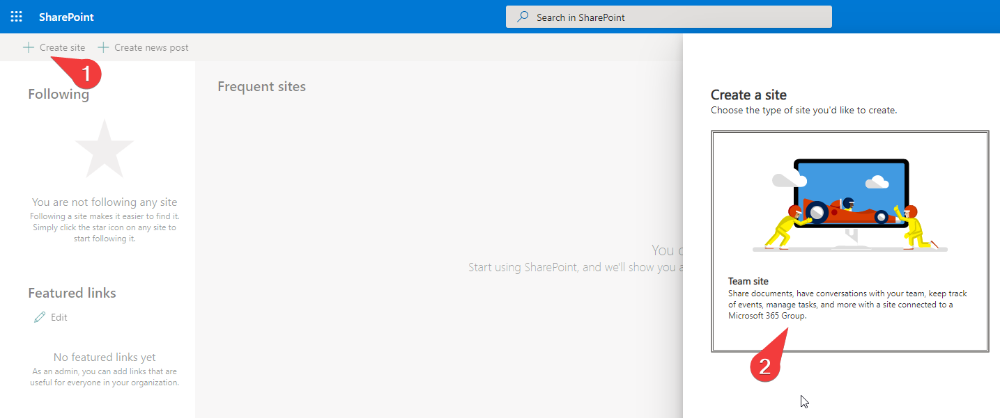
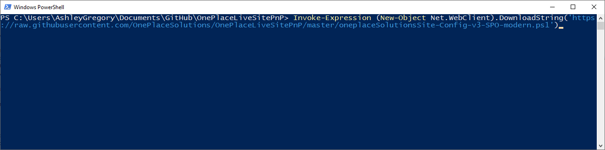
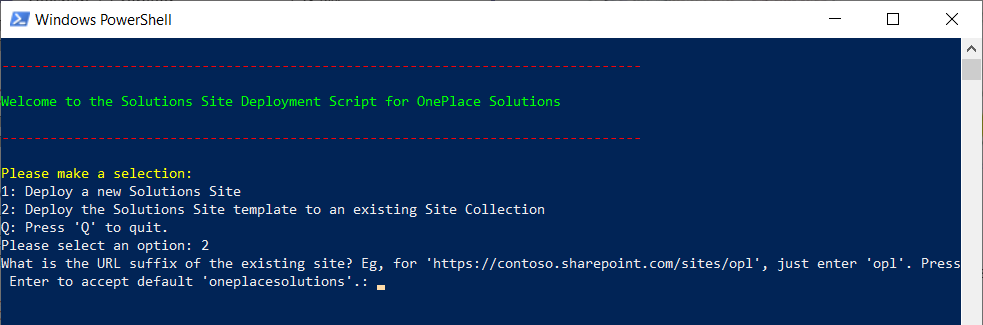
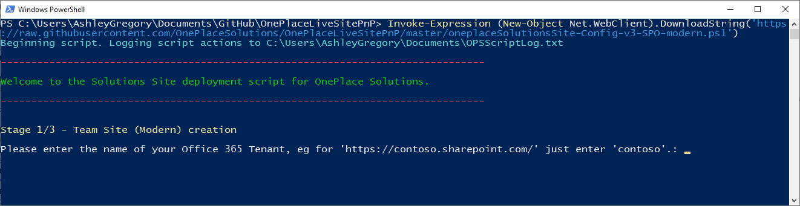
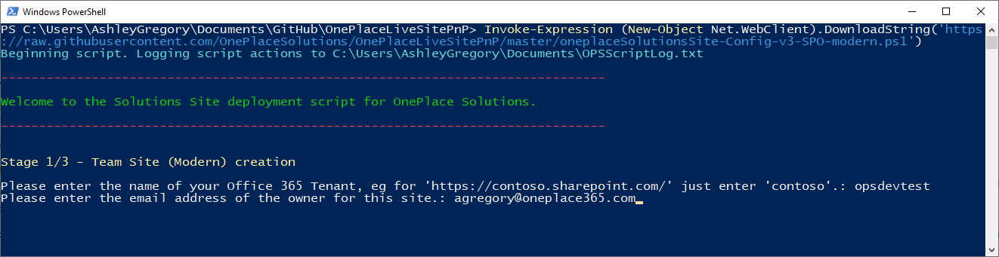
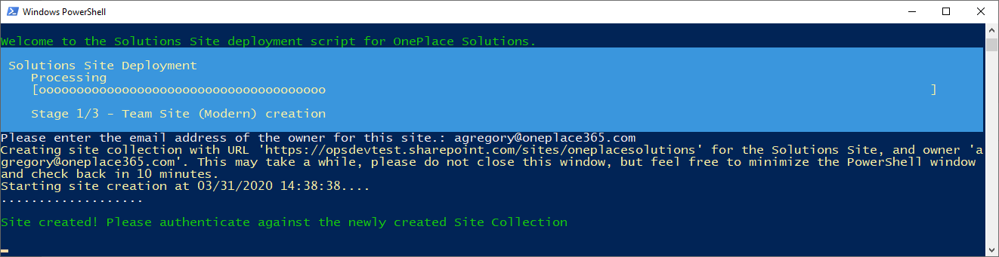
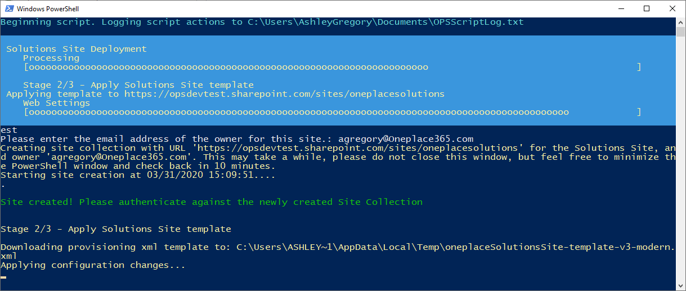
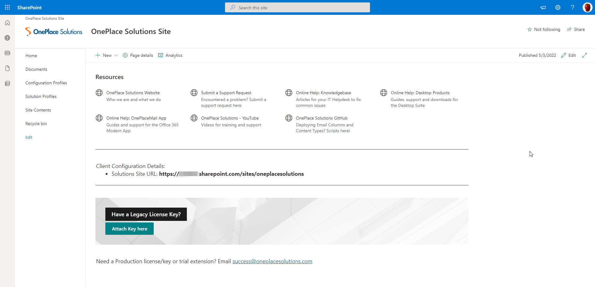
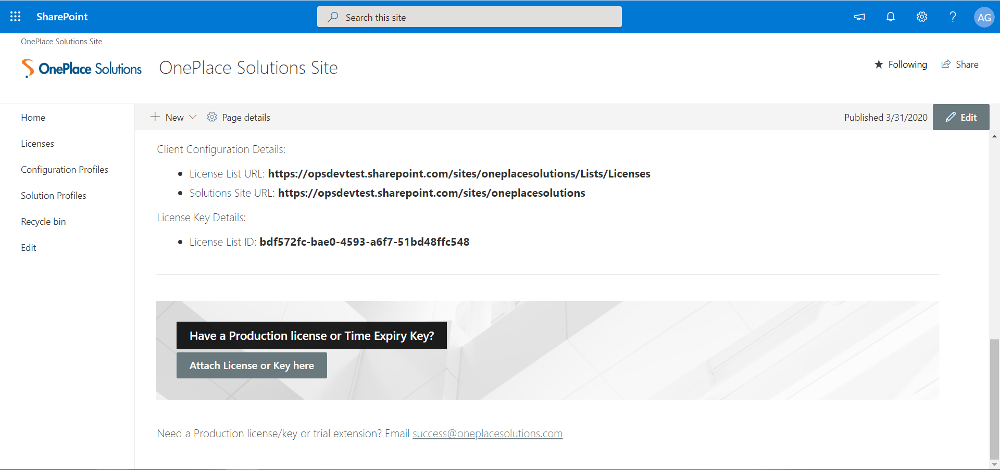

# OnePlaceLiveSitePnP ReadMe

## Table of Contents

1. [Pre-Requisites](#pre-requisites)
2. [SharePoint Online](#sharepoint-online)
3. [SharePoint On-Premise (2013/2016/2019)](#sharepoint-on-premise-201320162019)


## Pre-requisites


1.  Have either of the following SharePoint environments: SharePoint Online, SharePoint 2019 on-premises, SharePoint 2016 on-premises, SharePoint 2013 on-premises.

2.  PowerShell v3.0 or greater installed on your work environment. 

    Windows 10/8.1 and Windows Server 2012 and greater are all ready to go, but Windows 7 is preinstalled with PowerShell v2.0 and will need to be  upgraded. This can be done by [downloading and installing the Windows Management Framework 4.0](https://www.microsoft.com/en-au/download/details.aspx?id=40855). Download and install either the x64 or x86 version based on your version of Windows 7.

    

3.  The SharePoint PnP PowerShell cmdlets. 
You will need to install the the cmdlets on the machine you are running the script from that target your version of SharePoint, and we currently recommend using the last MSI release from [June 2020](https://github.com/pnp/PnP-PowerShell/releases/tag/3.22.2006.2). \
*31/8/2020 - There is a bug in the current release of the PnP Cmdlets that may interupt deployment, so we only advise using the June 2020 release at this time.*

    

    You will need to logon as a local Administrator to your machine to install the msi file.

    

4.  (Optional) (SharePoint Online Only) (Multi-Tenant) The latest [SharePoint Online Management Shell](https://www.microsoft.com/en-au/download/details.aspx?id=35588) installed on the machine you are running the script from. This is required if you would like the script to create a Site Collection for you automatically, and/or if you are deploying the template for a different Tenant to your own (eg, you are an Agent or Partner and are logged in to your own Microsoft 365 Tenant on your machine).

5.  If you need to deploy this Site without GitHub Access (eg, On-Premise deployment without internet access, secure environment), please download the applicable PowerShell Script ([SharePoint 2013/2016/2019](./oneplaceSolutionsSite-Config-v2-onPrem-classic.ps1) or [SharePoint Online](./oneplaceSolutionsSite-Config-v3-SPO-modern.ps1)), template XML ([SharePoint 2013/2016/2019](./oneplaceSolutionsSite-template-v2.xml) or [SharePoint Online](./oneplaceSolutionsSite-template-v3-modern.xml)) and [logo PNG](./oneplacesolutions-logo.png) and place them in '%LocalAppData%\Temp' on the machine you plan to run the script offline from. You must deploy from the downloaded templates within 7 days, or the script will consider them to be stale and attempt to download current versions from GitHub.
	

## SharePoint Online


> If you are deploying the Solutions Site to your own Microsoft 365 Tenant, please create a Team/Group Site from your SharePoint Home as below. Note it's URL, select **Option 1** in the script when prompted, and skip steps 4-7.
> > 
> > 

If any of the following applies to you:
 - You are logged in to your own Microsoft 365 Tenant on your machine and are deploying this Solutions Site in a different Tenant (multi-tenant scenario)
 - You want the script to create a Site Collection for you (requires SharePoint Administrator privileges)

 You must install the SharePoint Online Management Shell pre-requisite, and select **Option 2** in the script when prompted. The site will be created at 'https://&lt;yourTenant&gt;&#46;sharepoint&#46;com/sites/<b>oneplacesolutions</b>'.
\For multi-tenant scenarios where you want to deploy the template to an existing Site Collection (**Option 1**), please toggle SharePoint Online Management Shell Authentication to 'True' in the script by selecting 'S' in the menu before selecting another option.

*Note: Option 1 will fail if the site named (by default '\*/oneplacesolutions') already exists.*


\* All actions performed with the script will be logged to 'OPSScriptLog.txt' in your Documents folder (or under the Administrator account's Documents if running PowerShell as an Administrator). When requesting assistance with this script please send this log file as an attachment. This directory can be changed in-script.

\* The log file will be uploaded to the Documents folder in the Solutions Site at the end of deployment for your record keeping.


1.  Start PowerShell on your machine:

    

2.  Copy and paste the following command into your PowerShell command
    window and hit enter:

    ```PowerShell
    Invoke-Expression (New-Object Net.WebClient).DownloadString('https://raw.githubusercontent.com/OnePlaceSolutions/OnePlaceLiveSitePnP/master/oneplaceSolutionsSite-Config-v3-SPO-modern.ps1')
    ```

    

3.  The PowerShell script will execute and begin logging actions to the noted log file path. You will be prompted to choose whether to deploy the template to an existing Site Collection, or create a new Site Collection and deploy the template afterwards. 

    If the Solutions Site already exists and you wish to update it, or a problem was encountered during deployment, select **Option 1 **. You will be prompted to enter the URL of the existing Solutions Site.

    
    
	If you have selected **Option 1** please skip steps 4-7.
	
4.  (**Option 2 Only**) Please enter the SharePoint Root Site Collection URL and press enter. For example, 'htt<span>ps://contoso&#46;sharepoint&#46;com':
<!--
    
-->
5.  You will be asked to enter your credentials for Microsoft 365 \/ SharePoint Online.

6.  (**Option 2 Only**) You will then be asked to enter an email address for the owner of this Site Collection. Enter the same email address you logged in with, as only the Site Owner can deploy the script to the new Site Collection it's current state. You can change the Site Owner after deployment if you wish:

    

7.  (**Option 2 Only**) SharePoint will start provisioning the Site. Please leave the PowerShell window open while this happens, it will automatically resume the script when the Site is ready to configure. Depending on Microsoft service usage this can take up to 30 minutes, but creation usually occurs in less than 10 minutes.

    

8.  Once the Site Collection URL has been entered (or the Site Collection has been created as part of Option 2) the script will start configuring it for use.

    
	
9.  When configuration has completed, your Solutions Site URL, License List URL and License List ID will be displayed (these are also in the log file, and will be visible in the Solutions Site). You may also opt to automatically email these details now to OnePlace Solutions. These URLs will be kept on file for support purposes, and the License List ID will be required for your Production License.

    
10.  Finally, press Enter to open your Solutions Site.\
    The homepage contains some useful links for training and support resources, and when you have a Production license an overview of your License usage.\
    
    Scrolling down you can always find your Client Configuration Details (The License List URL and Solutions Site URL), and your License List ID. If you did not opt to email these automatically in the previous step, please email the License List ID to 'success@oneplacesolutions.com' when procuring a Production License. If you have received a Production license or Time Expiry Key, you may attach it here.\
    


## SharePoint On-Premise (2013/2016/2019)
1.  In Central Administration, create a site collection with the URL 'oneplacesolutions' and based on the Team Site template (Team Site (classic) if using SharePoint 2016/2019), note it's URL for later:

    

2.  Start PowerShell on your machine:

    

3.  Copy and paste the following command into your PowerShell command
    window and hit enter:

    ```PowerShell
    Invoke-Expression (New-Object Net.WebClient).DownloadString('https://raw.githubusercontent.com/OnePlaceSolutions/OnePlaceLiveSitePnP/master/oneplaceSolutionsSite-Config-v2-onPrem-classic.ps1')
    ```

    


4.  The PowerShell script will execute and prompt you to enter the Site Collection URL of the site collection you manually created in Step 1. You can either type it in or copy and paste the url into the command window and hit enter:

    

5.  You will be asked to enter your credentials for SharePoint. For on-premise it will be your domain\\username:

    

6.  The OnePlace Solutions site template will then be downloaded and the script will start configuring it for use:


    
7.  When configuration has completed, your Solutions Site URL, License List URL and License List ID will be displayed (these are also in the log file, and will be visible in the Solutions Site). You may also opt to automatically email these details now to OnePlace Solutions. These URLs will be kept on file for support purposes, and the License List ID will be required for your Production License.

    
8.  Finally, press Enter to open your Solutions Site.

	The homepage contains some useful links for training and support resources, and when you have a Production license an overview of your License usage. 
	
	
	Here you can always find your Client Configuration Details (The License List URL and Solutions Site URL), and your License List ID. If you did not opt to email these automatically in the previous step, please email the License List ID to 'success@oneplacesolutions.com' when procuring a Production License. If you have received a Production license or Time Expiry Key, you may attach it here.

