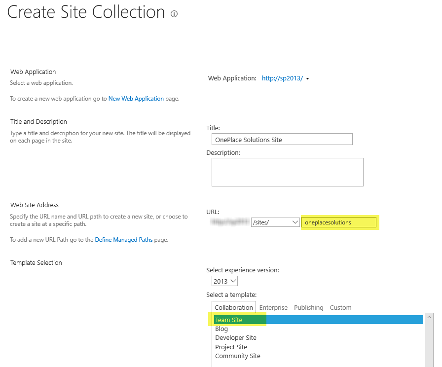
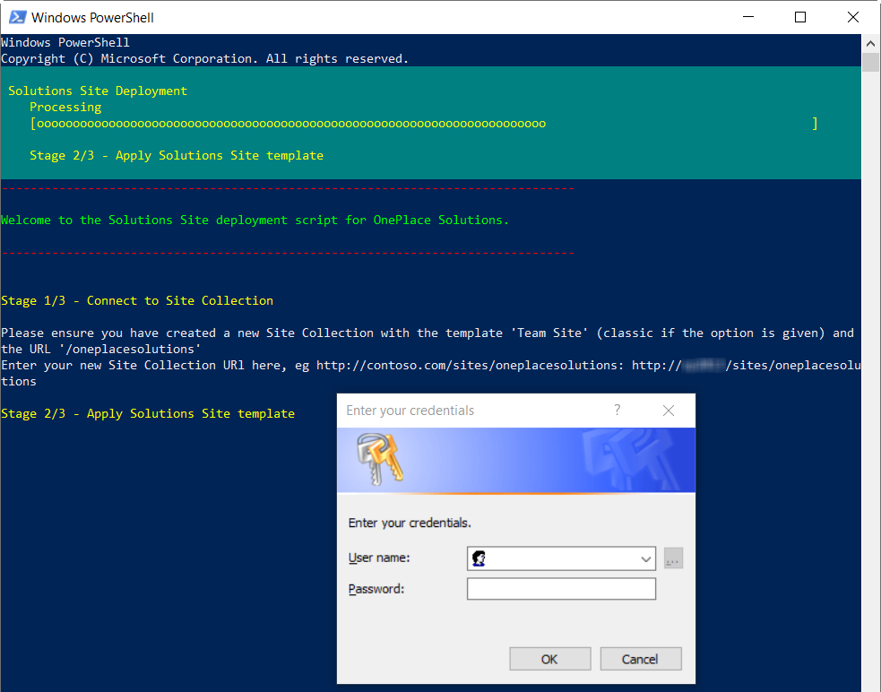
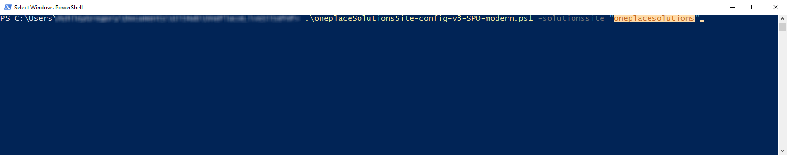

## Pre-requisites


1.  Have either of the following SharePoint environments: SharePoint Online, SharePoint 2019 on-premises, SharePoint 2016 on-premises, SharePoint 2013
    on-premises.

2.  PowerShell v3.0 or greater installed on your work environment. 

    Windows 10/8.1 and Windows Server 2012 and greater are all ready to go, but Windows 7 is preinstalled with PowerShell v2.0 and will need to be  upgraded. This can be done by [downloading and installing the Windows Management Framework 4.0](https://www.microsoft.com/en-au/download/details.aspx?id=40855). Download and install either the x64 or x86 version based on your version of Windows 7.

    

3.  The latest [SharePoint PnP PowerShell cmdlets](https://github.com/SharePoint/PnP-PowerShell/releases). You will need to install the the cmdlets that target your version of SharePoint.

    

    If you already have the PnP Powershell cmdlets installed, make sure you are on the most recent version by upgrading them by uninstalling the old version and [installing the new version](https://github.com/SharePoint/PnP-PowerShell/releases).

    You will need to logon as a local Administrator to your machine to install the msi file.

    

## SharePoint On-Premise (2013/2016/2019)
1.  In Central Administration, create a site collection based on the Team Site template, and note it's URL:



2.  Start PowerShell on your machine:

    

3.  Copy and paste the following command into your PowerShell command
    window and hit enter:

    ```PowerShell
    Invoke-Expression (New-Object Net.WebClient).DownloadString('https://raw.githubusercontent.com/OnePlaceSolutions/OnePlaceLiveSitePnP/master/oneplaceSolutionsSite-Config-v1.ps1')
    ```

    


4.  The PowerShell script will execute and prompt you to enter the Site Collection URL of the site collection you manually created in Step 1. You can either type it in or copy and paste the url into the command window and hit enter:

    

5.  You will be asked to enter your credentials for SharePoint. For SharePoint Online it will be your email address, for on-premise it will be your domain\\username:

    

6.  The OnePlace Solutions site template will then be downloaded and applied to your site collection:

    

    
	
## SharePoint Online
Site creation will be performed automatically with the configuration script. The site will be created at 'http://&lt;yourSharePoint&gt;&#46;sharepoint&#46;com/sites/<b>oneplacesolutions</b>'. This can be overridden by downloading and running the PowerShell script locally and defining the '-solutionssite' parameter:


Note that the script will not run if the site named already exists.
All actions performed with the script will be logged to 'OPSScriptLog.txt' in your Documents folder (or under the Administrator account's Documents if running PowerShell as an Administrator). This log file will be uploaded to the Documents folder in the Solutions Site at the end of deployment for your record keeping.


1.  Start PowerShell on your machine:

    

2.  Copy and paste the following command into your PowerShell command
    window and hit enter:

    ```PowerShell
    Invoke-Expression (New-Object Net.WebClient).DownloadString('https://raw.githubusercontent.com/OnePlaceSolutions/OnePlaceLiveSitePnP/master/oneplaceSolutionsSite-Config-v3-SPO-modern.ps1')
    ```

    


3.  The PowerShell script will execute, begin logging and tell you the log file path, and prompt you to enter your SharePoint Tenant name and hit enter. For example, if your Root SharePoint Site Collection is 'https://contoso.sharepoint.com', just enter 'contoso':

    

4.  You will be asked to enter your credentials for Microsoft 365 \/ SharePoint. For SharePoint Online this will be your email address.

5.  You will then be asked to enter an email address for the owner of this Site Collection. Enter the same email address you logged in with:

    

6.  SharePoint will start provisioning the Site. Please leave the PowerShell window open while this happens, it will automatically resume the script when the Site is ready to configure.

    

7.  Once SharePoint has created the Site, the script will start configuring it for use.

    
	
8.  When configuration has completed, your Solutions Site URL, License List URL and License List ID will be displayed (these are also in the log file, and will be visible in the Solutions Site). You may also opt to automatically email these details now to OnePlace Solutions. These URLs will be kept on file for support purposes, and the License List ID will be required for your Production License.

    
9.  Finally, press Enter to open your Solutions Site.
    
    