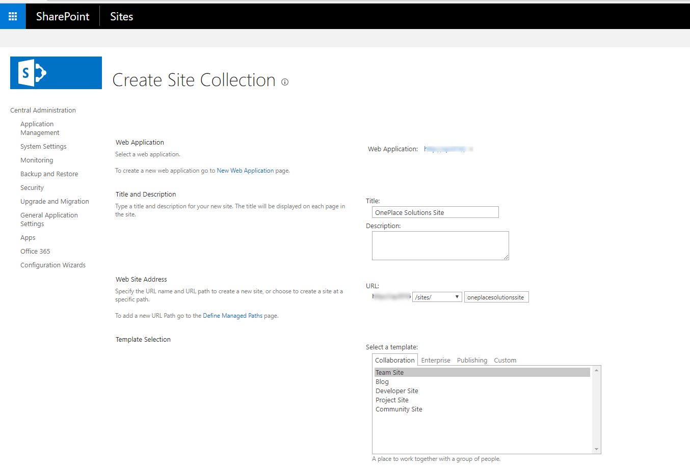
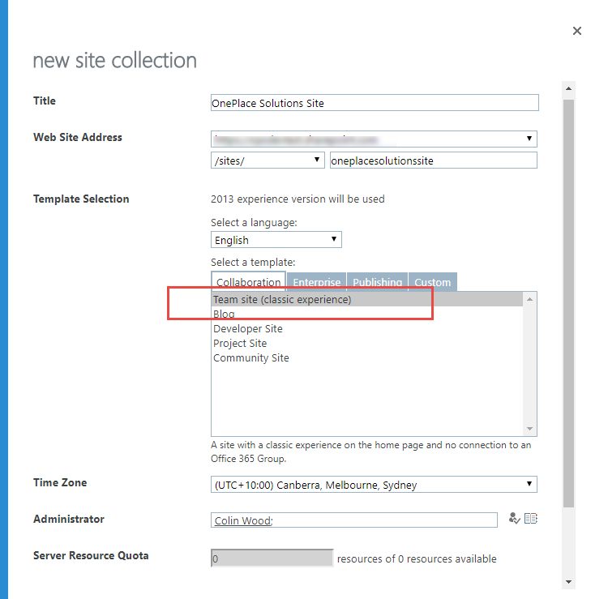
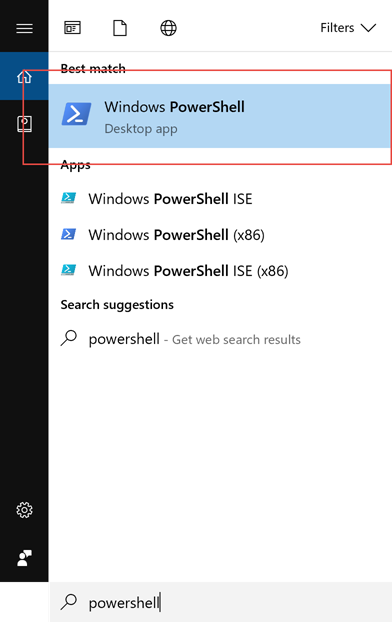
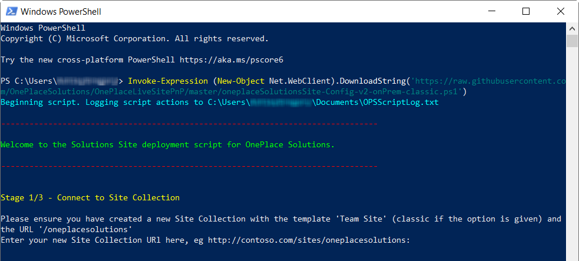

Pre-requisites
--------------
If you already have the PnP Powershell cmdlets installed make sure you are on the most recent version by upgrading them by uninstalling the old version and installing the new version from here:

<https://github.com/SharePoint/PnP-PowerShell/releases>

1.  Have either of the following SharePoint environments: SharePoint Online, SharePoint 2016 on-premise, SharePoint 2013
    on-premise.

2.  PowerShell v3.0 or greater installed on the machine. Windows 10/8.1
    and Windows Server 2012 and greater are all ready to go. Windows 7
    is preinstalled with v2.0 of PowerShell. PowerShell needs to be
    upgraded on Windows 7 machines. This can be done by downloading and
    installing the Windows Management Framework 4.0 from here:
    <https://www.microsoft.com/en-au/download/details.aspx?id=40855> .
    Download and install either the x64 or x86 version based on your
    version of Windows 7:

    

3.  Install the SharePoint PnP PowerShell cmdlets installed on the
    machine. You need to install the correct version of the cmdlets to
    target your version of SharePoint. Install the latest release msi
    files from here (new updates are applied monthly to the msi files):
    <https://github.com/SharePoint/PnP-PowerShell/releases>.

    You will need to logon as a local Administrator to your machine to install the msi file:

    

    

Manually create a SharePoint Site Collection
--------------------------------------------

On-Premise - Go to Central Administration and create a site collection based on the Team Site template:

SharePoint Online - Go to SharePoint Administration in your tenant and create a site collection based on the Team Site template:

Applying the OnePlace Solution Site configurations to your site collection
--------------------------------------

1.  Start PowerShell on your machine:

    

2.  Copy and paste the following command into your PowerShell command
    window and hit enter:

    > **Invoke-Expression (New-Object
    > Net.WebClient).DownloadString('https://raw.githubusercontent.com/OnePlaceSolutions/OnePlaceLiveSitePnP/master/oneplaceSolutionsSite-Config-v1.ps1')**
    >
    > Copy the text above, then in the PowerShell window right click at the
    > cursor and the command will be pasted into the window, then hit the
    > enter key to execute the command:

    

3.  The PowerShell script will execute and prompt you to enter the Site Collection Url of the site collection you manually created in the earlier step. You can either type it in        or copy and paste the url into the command window and hit enter:

    

4.  You will be asked to enter your credentials for SharePoint. For SharePoint Online it will be your email address, for on-premise it will be your domain\\username:

    

5.  The OnePlace Solutions site template will then be downloaded and applied to your site collection:

    

    
