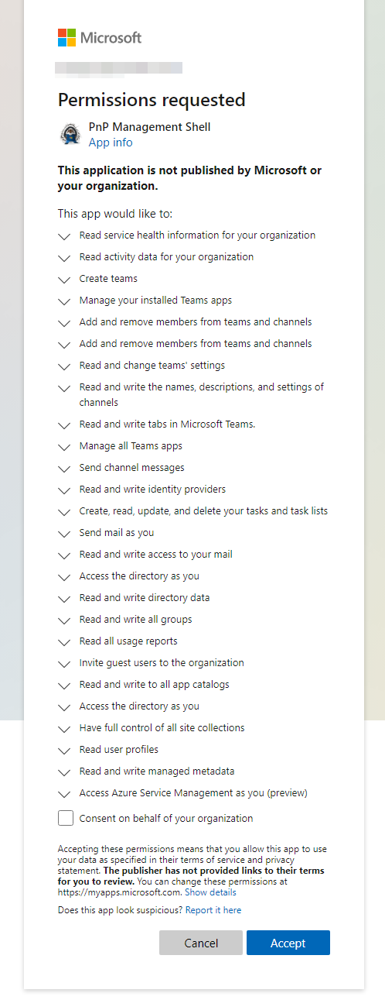
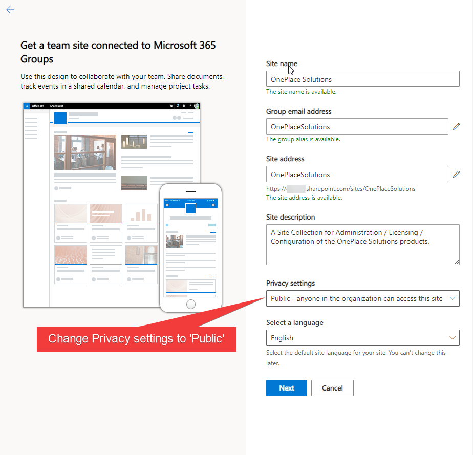
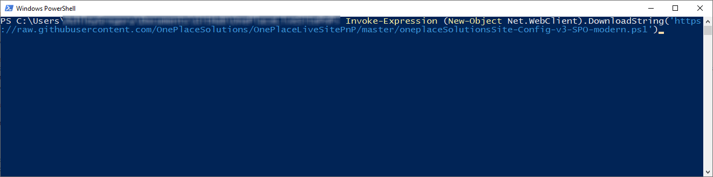
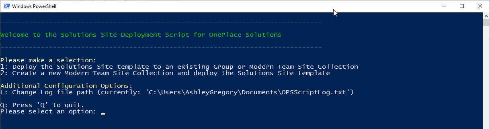
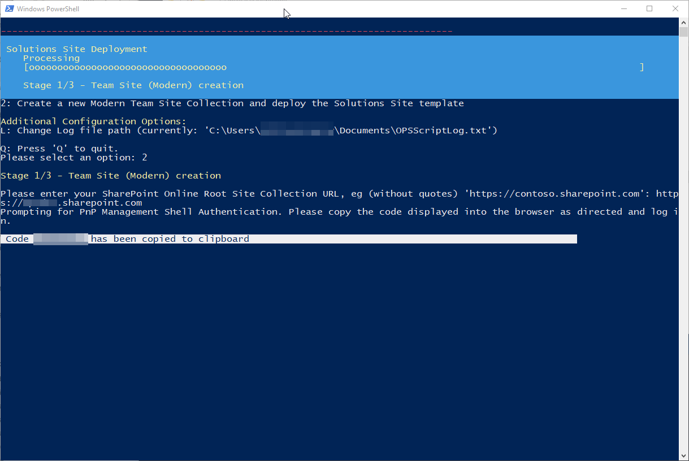
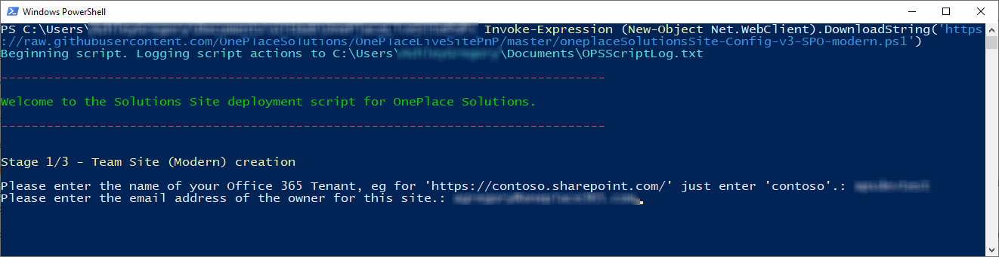
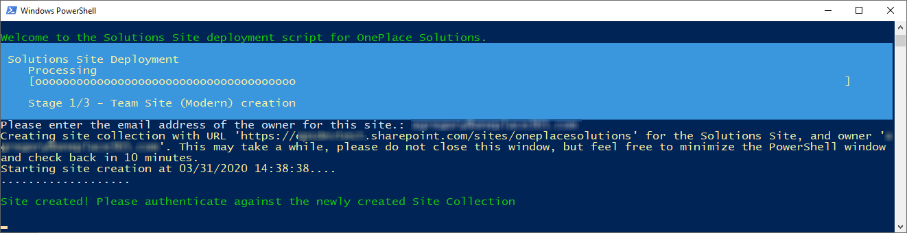
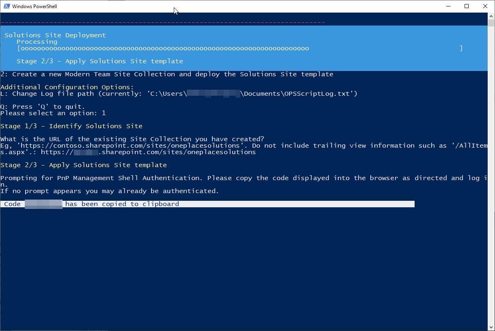
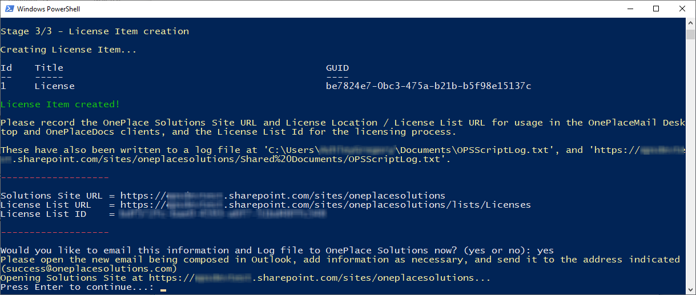
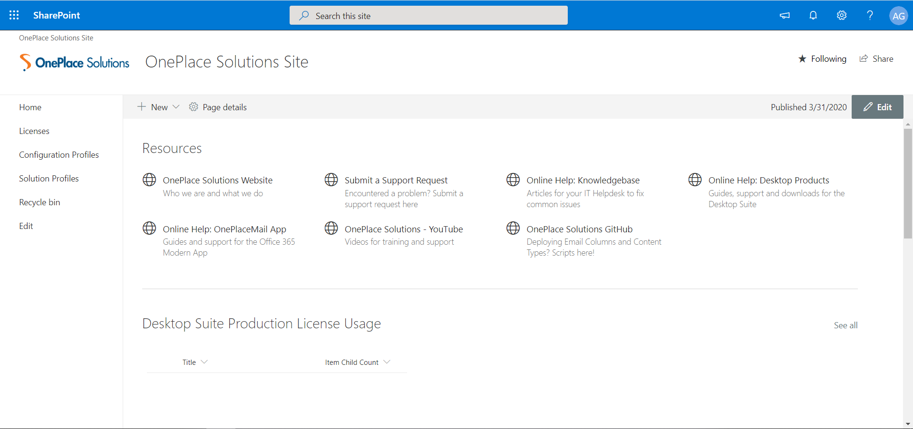

# OnePlaceLiveSitePnP ReadMe for Enterprise - SharePoint Online

A script to create the required Lists in a Site Collection for licensing and other uses by the OnePlace Solutions clients.

## Table of Contents

1. [Pre-Requisites](#pre-requisites)
2. [SharePoint Online](#sharepoint-online)


## Pre-requisites


1.  The following SharePoint environments: SharePoint Online

2.  **(SharePoint Online Only)** (Multi-Tenant supported) [The latest PnP.PowerShell](https://pnp.github.io/powershell/articles/installation.html) installed on the machine you are running the script from. You can run the below command in PowerShell (as Administrator) to install it. 

    Install new PnP.PowerShell Cmdlets:
    ```
    Install-Module -Name "PnP.PowerShell"
    ```
    Note that you will need to ensure you have uninstalled any previous 'Classic' PnP Cmdlets prior to installing this. If you have installed the cmdlets previously using an MSI file these need to be uninstalled from Control Panel, but if you have installed the cmdlets previously using PowerShell Get you can uninstall them with this command (as Administrator):

    ```
    Uninstall-Module 'SharePointPnPPowerShellOnline'
    ```
    
    This script will also require your Microsoft 365 Administrator to grant App access to the PnP Management Shell in your 365 Tenant. It is recommended that you check and grant this ahead of running the script by entering this command in PowerShell and following the directions. Documentation and more information [here](https://pnp.github.io/powershell/articles/authentication.html).
    ```
    Register-PnPManagementShellAccess
    ```
    > 
    
    * We recommend only granting this App access for your account, and if you no longer require this access after running the script you can delete it from your Microsoft 365 Tenant which will revoke it's permissions. [Microsoft Documentation on Deleting Enterprise Applications](https://docs.microsoft.com/en-us/azure/active-directory/manage-apps/delete-application-portal).
    * The PnP Management Shell is created by the PnP project to facilitate authentication and access control to your 365 Tenant, and is not published by OnePlace Solutions. Granting permissions for the PnP Management shell to a user/users only allows **delegated access**, the user must still authenticate and have the adequate permissions to perform any actions through the PnP Management Shell. In previous versions of the PnP Cmdlets these permissions did not need to be requested, but with the move to Modern Authentication these permissions are now explicitly requested.
    * This script only utilizes the 'Have full control of all Site Collections' permission pictured above, and this is restricted by the delegated permissions of the user that is authenticating.
	

## SharePoint Online

*All actions performed with the script will be logged to 'OPSScriptLog.txt' in your Documents folder (or possibly under the Administrator account's Documents if running PowerShell as an Administrator). When requesting assistance with this script please send this log file as an attachment. This directory can be changed in-script.*

*The log file will be uploaded to the Documents folder in the Solutions Site at the end of deployment for your record keeping.*

If you do not want the script to create a Site Collection automatically for you, please create a Team/Group Site from your SharePoint Home as below or create a Team Site(no group) in the SharePoint Admin Center. Note it's URL, and select **Option 1** in the script when prompted.
> 
> 

If you would like the script to create the initial Site Collection for you, select **Option 2** in the script when prompted. A Team Site(no group) will be created at 'https://&lt;yourTenant&gt;&#46;sharepoint&#46;com/sites/<b>oneplacesolutions</b>'.

*Note: Option 2 will fail if the site named (by default '\*/oneplacesolutions') already exists.*

1.  Start PowerShell on your machine:

    > 

2.  Copy and paste the following command into your PowerShell command
    window and hit enter:

    ```PowerShell
    Invoke-Expression (New-Object Net.WebClient).DownloadString('https://raw.githubusercontent.com/OnePlaceSolutions/OnePlaceLiveSitePnP/master/SharePoint%20Online/Enterprise/oneplaceSolutionsSite-Config-v4-SPO-modern-create.ps1')
    ```

    > 

3.  The PowerShell script will execute and begin logging actions to the noted log file path. You will be prompted to choose whether to deploy the template to an existing Site Collection, or create a new Site Collection and deploy the template to it automatically. 

    If you have created a Group/Team Site, or the Solutions Site already exists and you wish to update it, or a problem was encountered during initial deployment, select **Option 1**. You will be prompted to enter the URL of the existing Solutions Site.

    > 
    
	If you are deploying to an existing Site and have selected **Option 1** please move on to Step 4.
	
	3a.  (**Option 2 Only**) Please enter the SharePoint Root Site Collection URL and press enter. For example, 'htt<span>ps://contoso&#46;sharepoint&#46;com':

	3b.  (**Option 2 Only**) You will be asked to authenticate to your SharePoint Admin Site through the PnP Management Shell. Please follow the directions from the script to copy the code into the browser, and if required consent to the PnP Management Shell.
	> 

	3c.  (**Option 2 Only**) You will then be asked to enter an email address for the owner of this Site Collection. Enter the same email address you logged in with, as only the Site Owner can deploy the script to the new Site Collection it's current state. You can change the Site Owner after deployment if you wish:

	> 

	3d.  (**Option 2 Only**) SharePoint will start provisioning the Site. Please leave the PowerShell window open while this happens, it will automatically resume the script when the Site is ready to configure. Depending on Microsoft service usage this can take up to 30 minutes, but creation usually occurs in less than 10 minutes.

	> 

4.  Once the Site Collection URL has been entered (or the Site Collection has been created as part of Option 2) the script may prompt you to authenticate against the Site Collection through the PnP Management Shell. Please follow the directions from the script to copy the code into the browser, and if required consent to the PnP Management Shell. Afterwards, the script will start configuring the site for use.
	> 
	> 
	
	*If the script reports an issue downloading the template resources from GitHub, please download this [OfflineBundle.zip](../OfflineBundle.zip) and extract it's contents to %localappdata%/Temp on your machine.*
	
5.  When configuration has completed, your Solutions Site URL, License List URL and License List ID will be displayed (these are also in the log file noted earlier, and will be visible in the Solutions Site). You may be presented with the option to automatically email these details now to OnePlace Solutions. These URLs will be kept on file for support purposes, and the License List ID will be required for provisioning your Production License.

    > 
6.  Finally, press Enter to open your Solutions Site.\
    The homepage contains some useful links for training and support resources, and when you have a Production license an overview of your License usage.\
    > 
    Scrolling down you can always find your Client Configuration Details (The License List URL and Solutions Site URL), and your License List ID. If you did not opt to email these automatically in the previous step, please email the License List ID to 'success@oneplacesolutions.com' when procuring a Production License. If you have received a Production license or Time Expiry Key, you may attach it here.\
    > 
