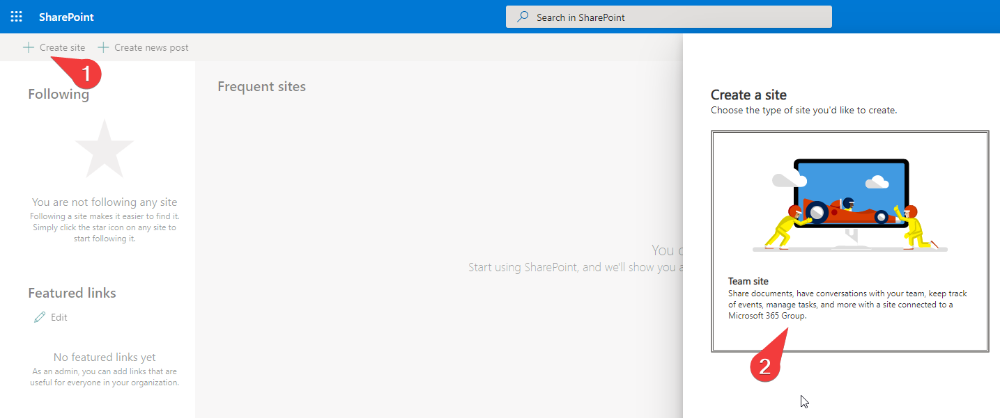
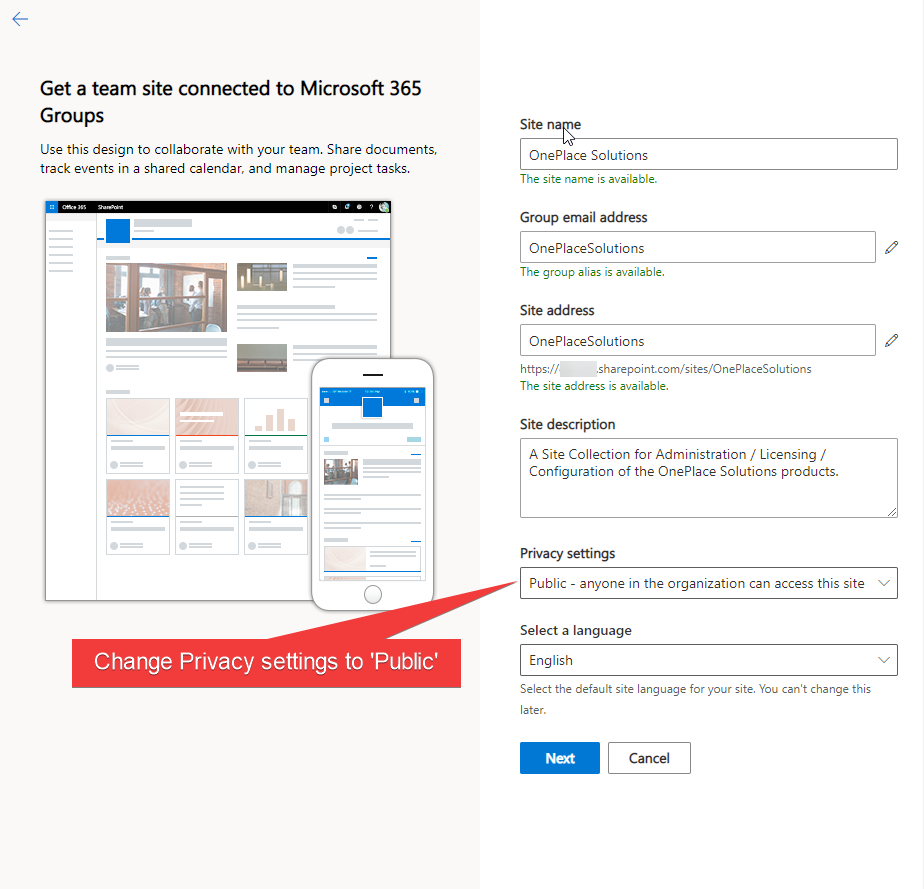
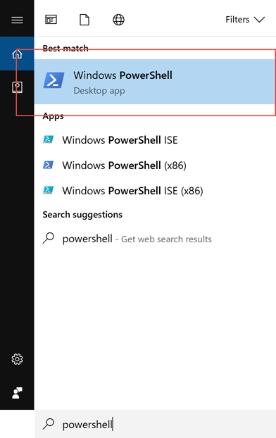
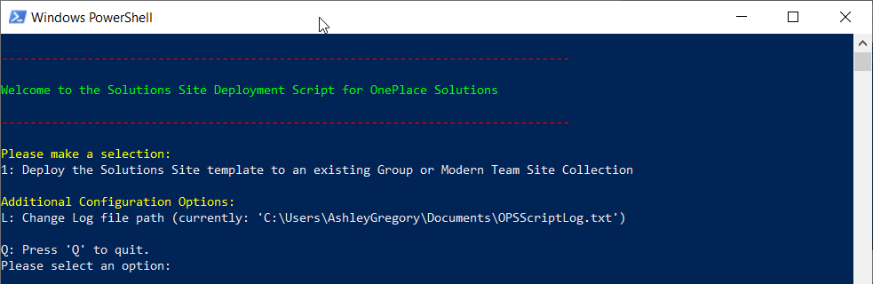
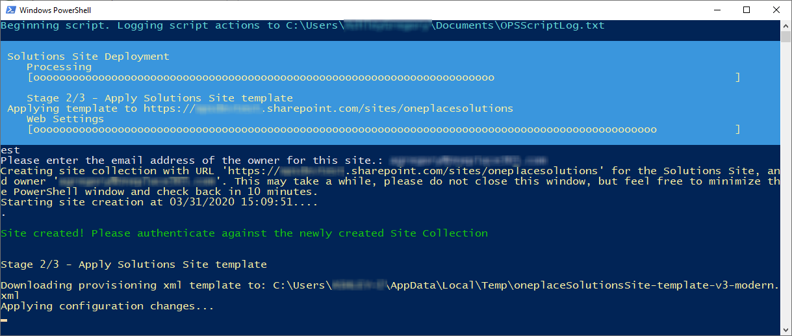
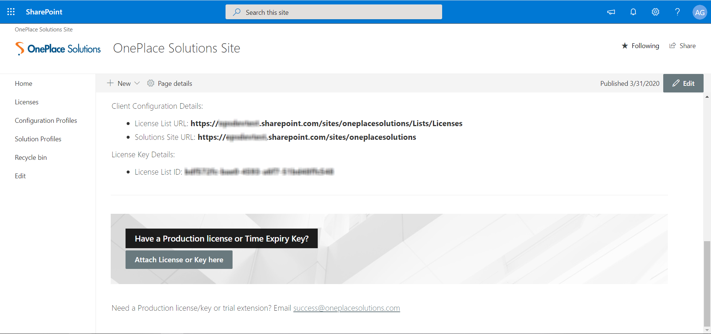

# OnePlaceLiveSitePnP ReadMe for SMB - SharePoint Online

A script to create the required Lists in a Site Collection for licensing and other uses by the OnePlace Solutions clients.

## Table of Contents

1. [Pre-Requisites](#pre-requisites)
2. [SharePoint Online](#sharepoint-online)


## Pre-requisites


1.  The following SharePoint environments: SharePoint Online.

2.  **(SharePoint Online Only)** (Multi-Tenant supported) [The latest PnP.PowerShell](https://pnp.github.io/powershell/articles/installation.html) installed on the machine you are running the script from. You can run the below command in PowerShell (as Administrator) to install it. 

    Install new PnP.PowerShell Cmdlets:
    ```
    Install-Module -Name "PnP.PowerShell"
    ```
   
## SharePoint Online

*All actions performed with the script will be logged to 'OPSScriptLog.txt' in your Documents folder (or possibly under the Administrator account's Documents if running PowerShell as an Administrator). When requesting assistance with this script please send this log file as an attachment. This directory can be changed in-script.*

*The log file will be uploaded to the Documents folder in the Solutions Site at the end of deployment for your record keeping.*

1.	Create a Team/Group Site with the url 'oneplacesolutions' as below in SharePoint or create a Team Site(no group) in the SharePoint Admin Center. Note it's URL, and select **Option 1** in the script when prompted.
> 
> 

2.  Start PowerShell on your machine:

    > 

3.  Copy and paste the following command into your PowerShell command
    window and hit enter:

    ```PowerShell
    Invoke-Expression (New-Object Net.WebClient).DownloadString('https://raw.githubusercontent.com/OnePlaceSolutions/OnePlaceLiveSitePnP/master/SharePoint%20Online/SMB/oneplaceSolutionsSite-Config-v4-SPO-modern.ps1')
    ```

    > 

4.  The PowerShell script will execute and begin logging actions to the noted log file path. You will be prompted to deploy the template to an existing Site Collection.

    > 

5.  Once the Site Collection URL has been entered (or the Site Collection has been created as part of Option 2) the script will prompt you to authenticate against the Site Collection through PnP. Afterwards the script will start configuring the site for use.
	> 
	
	*If the script reports an issue downloading the template resources from GitHub, please download this [OfflineBundle.zip](../OfflineBundle.zip) and extract it's contents to %localappdata%/Temp on your machine.*
	
6.  When configuration has completed, your Solutions Site URL, License List URL and License List ID will be displayed (these are also in the log file noted earlier, and will be visible in the Solutions Site). You may be presented with the option to automatically email these details now to OnePlace Solutions. These URLs will be kept on file for support purposes, and the License List ID will be required for provisioning your Production License.

    > 
7.  Finally, press Enter to open your Solutions Site.\
    The homepage contains some useful links for training and support resources, and when you have a Production license an overview of your License usage.\
    > 
    Scrolling down you can always find your Client Configuration Details (The License List URL and Solutions Site URL), and your License List ID. If you did not opt to email these automatically in the previous step, please email the License List ID to 'success@oneplacesolutions.com' when procuring a Production License. If you have received a Production license or Time Expiry Key, you may attach it here.\
    > 
