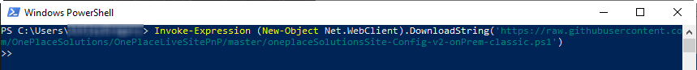
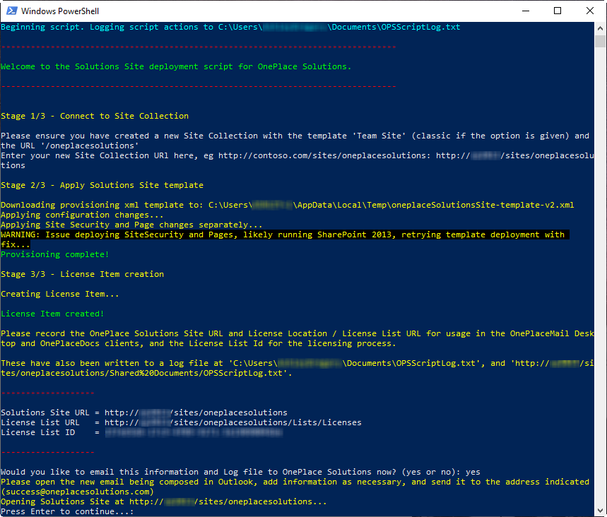

# OnePlaceLiveSitePnP ReadMe for SharePoint On-Premises

A script to create the required Lists in a Site Collection for licensing and other uses by the OnePlace Solutions clients.

## Pre-requisites


1.  Have either of the following SharePoint environments: SharePoint 2019 on-premises, SharePoint 2016 on-premises, SharePoint 2013 on-premises.

2.  PowerShell v3.0 or greater installed on your work environment. 

    If you are using Windows 10/8.1/Server 2012 you will already have a compatible version of PowerShell and can skip this point.
    
    If you are using Windows 7, this is preinstalled with PowerShell v2.0 and will need to be  upgraded. This can be done by [downloading and installing the Windows Management Framework 4.0](https://www.microsoft.com/en-au/download/details.aspx?id=40855). Download and install either the x64 or x86 version based on your version of Windows 7.

    > 

3.  **(SharePoint On-Premise Only)** [The SharePoint PnP PowerShell cmdlets](https://github.com/pnp/PnP-PowerShell). 
    You will need to install **only the the cmdlets that target your version of SharePoint** on the machine you are running the script from. If you have installed the cmdlets previously using an MSI file these need to be uninstalled from Control Panel, but if you have installed the cmdlets previously using PowerShell Get you can update them with this command:
    ```
    Update-Module SharePointPnPPowerShell<version>
    ```
    
    This is the command pictured to install the PnP Cmdlets via PowerShell Get:
    ```
    Install-Module SharePointPnPPowerShell<version>
    ```
    > 


4.  If you need to deploy this Site without GitHub Access (eg, On-Premise deployment without internet access, secure environment), please download the applicable PowerShell Script ([SharePoint 2013/2016/2019](./oneplaceSolutionsSite-Config-v2-onPrem-classic.ps1)), template XML ([SharePoint 2013/2016/2019](https://raw.githubusercontent.com/OnePlaceSolutions/OnePlaceLiveSitePnP/master/oneplaceSolutionsSite-template-v2.xml)) and [logo PNG](./oneplacesolutions-logo.png) and place them in '%LocalAppData%\Temp' on the machine you plan to run the script offline from. 


## Setting up the Site - SharePoint On-Premise (2013/2016/2019)
1.  In Central Administration, create a site collection with the URL 'oneplacesolutions' and based on the Team Site template (Team Site (classic) if using SharePoint 2016/2019), note it's URL for later:

    > 

2.  Start PowerShell on your machine:

    > 

3.  Copy and paste the following command into your PowerShell command
    window and hit enter:

    ```PowerShell
    Invoke-Expression (New-Object Net.WebClient).DownloadString('https://raw.githubusercontent.com/OnePlaceSolutions/OnePlaceLiveSitePnP/master/SharePoint%20On-Premise/oneplaceSolutionsSite-Config-v2-onPrem-classic.ps1')
    ```

    > 


4.  The PowerShell script will execute and prompt you to enter the Site Collection URL of the site collection you manually created in Step 1. You can either type it in or copy and paste the url into the command window and hit enter:

    > 

5.  You will be asked to enter your credentials for SharePoint. For on-premise it will be your domain\\username:

    > 

6.  The OnePlace Solutions site template will then be downloaded and the script will start configuring it for use:

    > 
	
	*If the script reports an issue downloading the template resources from GitHub, please download this [OfflineBundle.zip](./OfflineBundle.zip) and extract it's contents to %localappdata%/Temp on your machine.*
	
7.  When configuration has completed, your Solutions Site URL, License List URL and License List ID will be displayed (these are also in the log file, and will be visible in the Solutions Site). You may also opt to automatically email these details now to OnePlace Solutions. These URLs will be kept on file for support purposes, and the License List ID will be required for your Production License.

    > 
8.  Finally, press Enter to open your Solutions Site.

	The homepage contains some useful links for training and support resources, and when you have a Production license an overview of your License usage. 
	> 
	
	Here you can always find your Client Configuration Details (The License List URL and Solutions Site URL), and your License List ID. If you did not opt to email these automatically in the previous step, please email the License List ID to 'success@oneplacesolutions.com' when procuring a Production License. If you have received a Production license or Time Expiry Key, you may attach it here.

